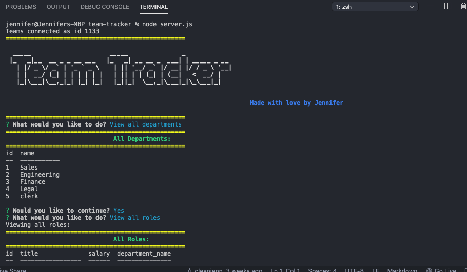

# team-tracker

https://cleanjenn.github.io/team-tracker/

## Mock Up



## Table of Contents 

- [Mock Up](#mock-up)
- [Description](#description)
- [User Story](#user-story)
- [Installation](#installation)
- [Usage](#usage)
- [Contributing](#contributing)
- [Questions](#questions)

## Description 

I create interfaces that make it easy for non-developers to view and interact with information stored in databases. This command-line application offers the ability to manage a company's employee database, using Node.js, Inquirer, and MySQL.

The full video showing functionality of the appliication can be accesed via this link:
[Video Link](https://drive.google.com/file/d/1MGf634c4-ZrY79KZ1FDsZuIj2EJcrLqt/view?usp=sharing)

## User Story 
```
AS A business owner
I WANT to be able to view and manage the departments, roles, and employees in my company
SO THAT I can organize and plan my business
```

## Installations 
`npm init`<br />
`npm instal node`<br />
`npm install mysql2`<br />
`npm install inquirer`<br />
`npm install figlet`<br />
`npm install seed`<br />
`npm install console.table`
## Usage
```
Ability to view, add, update all employees, roles and departments all by the usage of the command-line. 
```
## Contributions

[Jennifer](https://github.com/cleanjenn)

## Questions 

Feel free to contact me via email: <br /> [Email](mailto:jennifer23gomez7@gmail.com)<br /> 
[Github](https://github.com/cleanjenn)<br />